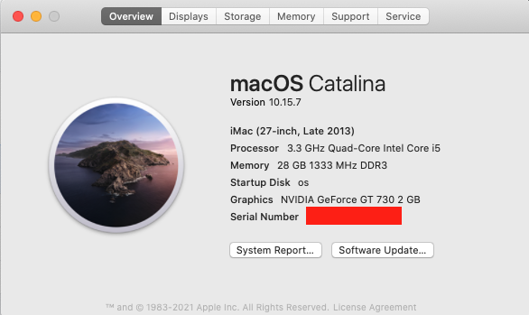
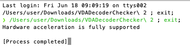

# i5-4590-B85M-gt730-hackintosh

[教程](https://wtfsec.org/posts/opencore-%E9%BB%91%E8%98%8B%E6%9E%9C10.15-%E7%B4%80%E9%8C%84/)
 
cpu：intel i5 4590

主板：asus B85M-G

顯卡：GT730-MG-2GD3

---

系統版本：macOS Catalina 10.15.7

OpenCore 版本：0.70

HD Graphics 4600：正常(以前以為壞了，去BIOS看才發現只是被禁用了)

GT730：正常。原生驅動。注意：gt730 僅支持開普勒架構的。

3.5mm聲音：正常使用，使用AppleALC驅動。

有線網卡：正常。

睡眠喚醒：正常。

關機開機：正常。

硬件加速：正常。

iCloud & App Store & iMessage & FaceTime：請自行生成MLB、 ROM、SystemSerialNumber、SystemUUID，並相應的修改PlatformInfo -> Generic。

USB port 定製：按照 [這個](https://github.com/corpnewt/USBMap) 定製完了之後，替換掉我的，並修改配置文件。

---
更新日誌：

2020/04/09:更新opencore版本0.5.7

2020/04/12:修改配置文件，啟用官方RTC補丁，修復啟用小憩後自動喚醒的問題。

2020/05/01:修改ssdt-plug.aml為opencore0.5.7對應的版本，修復睡死問題。

2020/05/20:更新opencore版本0.5.8、添加SSDT-EC.aml

2021/6/18:更新 opencore 版本0.7.0